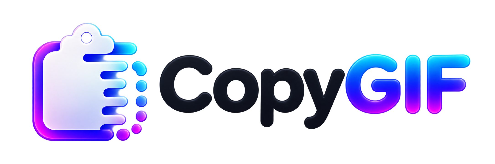

<p align="center">
  
</p>

# CopyGIF

CopyGIF is a lightweight Windows GIF picker powered by KLIPY. Press a global keyboard shortcut, search, and copy the actual `.gif` file to the Windows clipboard.

## Features

- Opens from anywhere with `Alt+G` by default.
- Searches KLIPY asynchronously without freezing the interface.
- Shows lightweight static thumbnails and animates a GIF when you hover over it.
- Copies a real GIF file, not a bitmap, URL, or HTML fragment.
- Keeps optional Favorites and Recents libraries on your device.
- Stores the KLIPY API key with Windows Data Protection API for the current user.
- Supports custom hotkeys, window placement, library limits, and startup behavior.
- Runs quietly in the Windows notification area.

## Requirements

- Windows 10 or Windows 11, x64
- .NET Framework 4.8
- A KLIPY API key

KLIPY test keys are currently limited to 100 API calls per hour. See the [KLIPY developers page](https://klipy.com/developers) for a key, current limits, attribution requirements, and production access.

## Install

### PowerShell installer

After the repository and its first GitHub Release are public, open PowerShell and run:

```powershell
irm https://raw.githubusercontent.com/hphifer99/CopyGIF/main/install.ps1 | iex
```

The installer downloads the latest `CopyGIF-win-x64.zip` release, verifies its published SHA-256 checksum, installs it for the current user under `%LOCALAPPDATA%\Programs\CopyGIF`, creates a Start menu shortcut, registers CopyGIF in Windows Installed apps, and launches it. Administrator rights are not required.

### Manual install

1. Download `CopyGIF-win-x64.zip` and `CopyGIF-win-x64.sha256` from [GitHub Releases](https://github.com/hphifer99/CopyGIF/releases).
2. Verify the checksum if desired:

   ```powershell
   Get-FileHash .\CopyGIF-win-x64.zip -Algorithm SHA256
   ```

3. Extract the ZIP to a folder you control.
4. Run `CopyGIF.exe`.

CopyGIF is not currently code-signed. Windows SmartScreen may warn on an early release. Verify that the file came from this repository and that its SHA-256 checksum matches the release asset before running it.

## First run

1. Start CopyGIF.
2. Select **Get a KLIPY API key** in the welcome window.
3. Paste the key and select **Save**.
4. Press `Alt+G`, search, and select a GIF to put the actual file on the clipboard.
5. Paste it into an application that accepts file pastes or file drops.

CopyGIF starts with Windows by default. You can turn this off in Settings. Right-click the notification-area icon to open CopyGIF, open Settings, or exit.

## Local data and privacy

CopyGIF does not include telemetry, advertising, or a CopyGIF account system. Search terms and media requests are sent to KLIPY because that service supplies the search results and GIF files. KLIPY states that it may collect information including IP addresses, search terms, and content viewed. Read [PRIVACY.md](PRIVACY.md) and [KLIPY's privacy policy](https://klipy.com/support/privacy-policy) before use.

CopyGIF stores settings and optional library files under `%LOCALAPPDATA%\CopyGIF`. Temporary clipboard files are stored under `%TEMP%\CopyGIF`. Uninstalling preserves user data unless you explicitly request its removal.

## Build from source

Install Visual Studio 2022 with the **.NET desktop development** workload and the .NET Framework 4.8 targeting pack.

1. Clone the repository.
2. Open `CopyGIF.slnx` in Visual Studio.
3. Restore NuGet packages.
4. Build `Release | Any CPU`. The project emits an x64 executable.

To create the same release ZIP and checksum used by GitHub Actions, run this from a Developer PowerShell where `nuget.exe` and `msbuild.exe` are available:

```powershell
.\scripts\Build-Release.ps1
```

Release engineering details are in [RELEASING.md](RELEASING.md).

## Current limitations

- The first hover of a GIF can take a moment while its animated preview is downloaded and cached.
- Search currently returns one configured result page. Automatic pagination is intentionally deferred.
- Public binaries are unsigned until a code-signing process is added.

## Security

Please report suspected vulnerabilities privately as described in [SECURITY.md](SECURITY.md). Do not include API keys or other secrets in an issue, screenshot, log, or sample configuration.

## License and attribution

CopyGIF source code is licensed under the [MIT License](LICENSE.txt).

CopyGIF distributes XamlAnimatedGif 2.3.2 under the Apache License 2.0. See [THIRD-PARTY-NOTICES.md](THIRD-PARTY-NOTICES.md) and the included license text.

GIF search and media are powered by [KLIPY](https://klipy.com/developers). CopyGIF is an independent project and is not affiliated with, endorsed by, or sponsored by KLIPY or Kikliko, Inc. KLIPY and related marks belong to their respective owners.
